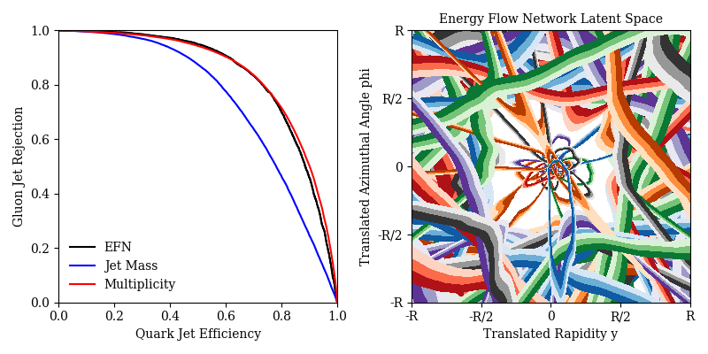

# Stand Alone Environment on JupyterHub with GPU Access

For a quick and easy way to setup a python environment with GPU access on JupyterHub, clone this repository using

```
git clone https://github.com/taylorFaucett/jupyterhub-make-example EFN
```

This will download everything in this repo into a directory called EFN. You will need to set permissions for the main file. This can be done by issuing the command

```
chmod +x main
```

Python packages are managed by `environment.yml`. If you issue the command `make run` or `make update`, a conda environment will be created with the conda/pip packages placed in environment.yml. 

To run the EFN example in "efn_example.py", simply execute the command `make run`. A simple EFN from the `energyflow` package is used as a test for the GPU. This code is taken from: [https://energyflow.network/examples/](https://energyflow.network/examples/)

```python
#  ______ ______ _   _
# |  ____|  ____| \ | |
# | |__  | |__  |  \| |
# |  __| |  __| | . ` |
# | |____| |    | |\  |
# |______|_|    |_| \_|
#  ________   __          __  __ _____  _      ______
# |  ____\ \ / /    /\   |  \/  |  __ \| |    |  ____|
# | |__   \ V /    /  \  | \  / | |__) | |    | |__
# |  __|   > <    / /\ \ | |\/| |  ___/| |    |  __|
# | |____ / . \  / ____ \| |  | | |    | |____| |____
# |______/_/ \_\/_/    \_\_|  |_|_|    |______|______|

# EnergyFlow - Python package for high-energy particle physics.
# Copyright (C) 2017-2020 Patrick T. Komiske III and Eric Metodiev

# standard library imports
from __future__ import absolute_import, division, print_function

# energyflow imports
import energyflow as ef
import matplotlib.pyplot as plt
# standard numerical library imports
import numpy as np
from energyflow.archs import EFN
from energyflow.datasets import qg_jets
from energyflow.utils import data_split, to_categorical
from sklearn.metrics import roc_auc_score, roc_curve

################################### SETTINGS ##################################
# the commented values correspond to those in 1810.05165
###############################################################################

# data controls, can go up to 2000000 total for full dataset
train, val, test = 75000, 10000, 15000
# train, val, test = 1000000, 200000, 200000

# network architecture parameters
Phi_sizes, F_sizes = (100, 100, 128), (100, 100, 100)
# Phi_sizes, F_sizes = (100, 100, 256), (100, 100, 100)

# network training parameters
num_epoch = 5
batch_size = 500

###############################################################################

# load data
X, y = qg_jets.load(train + val + test)

# ignore pid information
X = X[:, :, :3]

# convert labels to categorical
Y = to_categorical(y, num_classes=2)

print("Loaded quark and gluon jets")

# preprocess by centering jets and normalizing pts
for x in X:
    mask = x[:, 0] > 0
    yphi_avg = np.average(x[mask, 1:3], weights=x[mask, 0], axis=0)
    x[mask, 1:3] -= yphi_avg
    x[mask, 0] /= x[:, 0].sum()

print("Finished preprocessing")

# do train/val/test split
(z_train, z_val, z_test, p_train, p_val, p_test, Y_train, Y_val, Y_test) = data_split(
    X[:, :, 0], X[:, :, 1:], Y, val=val, test=test
)

print("Done train/val/test split")
print("Model summary:")

# build architecture
efn = EFN(input_dim=2, Phi_sizes=Phi_sizes, F_sizes=F_sizes)

# train model
efn.fit(
    [z_train, p_train],
    Y_train,
    epochs=num_epoch,
    batch_size=batch_size,
    validation_data=([z_val, p_val], Y_val),
    verbose=1,
)

# get predictions on test data
preds = efn.predict([z_test, p_test], batch_size=1000)

# get ROC curve
efn_fp, efn_tp, threshs = roc_curve(Y_test[:, 1], preds[:, 1])

# get area under the ROC curve
auc = roc_auc_score(Y_test[:, 1], preds[:, 1])
print()
print("EFN AUC:", auc)
print()

# some nicer plot settings
plt.rcParams["font.family"] = "serif"
plt.rcParams["figure.autolayout"] = True

fig, axes = plt.subplots(1, 2, figsize=(8, 4))

######################### ROC Curve Plot #########################

# get multiplicity and mass for comparison
masses = np.asarray([ef.ms_from_p4s(ef.p4s_from_ptyphims(x).sum(axis=0)) for x in X])
mults = np.asarray([np.count_nonzero(x[:, 0]) for x in X])
mass_fp, mass_tp, threshs = roc_curve(Y[:, 1], -masses)
mult_fp, mult_tp, threshs = roc_curve(Y[:, 1], -mults)

# plot the ROC curves
axes[0].plot(efn_tp, 1 - efn_fp, "-", color="black", label="EFN")
axes[0].plot(mass_tp, 1 - mass_fp, "-", color="blue", label="Jet Mass")
axes[0].plot(mult_tp, 1 - mult_fp, "-", color="red", label="Multiplicity")

# axes labels
axes[0].set_xlabel("Quark Jet Efficiency")
axes[0].set_ylabel("Gluon Jet Rejection")

# axes limits
axes[0].set_xlim(0, 1)
axes[0].set_ylim(0, 1)

# make legend and show plot
axes[0].legend(loc="lower left", frameon=False)

######################### Filter Plot #########################

# plot settings
R, n = 0.4, 100
colors = ["Reds", "Oranges", "Greens", "Blues", "Purples", "Greys"]
grads = np.linspace(0.45, 0.55, 4)

# evaluate filters
X, Y, Z = efn.eval_filters(R, n=n)

# plot filters
for i, z in enumerate(Z):
    axes[1].contourf(X, Y, z / np.max(z), grads, cmap=colors[i % len(colors)])

axes[1].set_xticks(np.linspace(-R, R, 5))
axes[1].set_yticks(np.linspace(-R, R, 5))
axes[1].set_xticklabels(["-R", "-R/2", "0", "R/2", "R"])
axes[1].set_yticklabels(["-R", "-R/2", "0", "R/2", "R"])
axes[1].set_xlabel("Translated Rapidity y")
axes[1].set_ylabel("Translated Azimuthal Angle phi")
axes[1].set_title("Energy Flow Network Latent Space", fontdict={"fontsize": 10})

plt.savefig("efn_plot.png")

```

